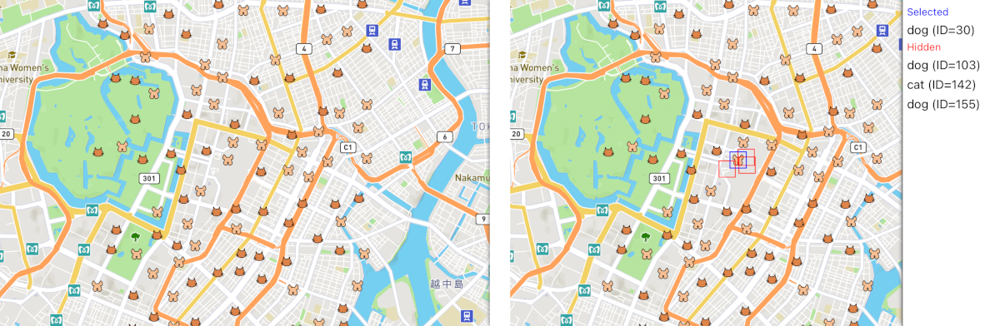

English / [日本語](./README_ja.md)

# Example for Mapbox Collision Boxes

A simple [Vue 3](https://vuejs.org) app to demonstrate `mapbox-collision-boxes`.
This project was generated with `npm init vue@latest`.

This app shows a [Mapbox](https://www.mapbox.com) map around Tokyo Station, and randomly spreads cat and dog symbols.
You can click a cat or dog symbol and see which symbols are hidden by it.


## Getting started

### Prerequisites

You need [Node.js](https://nodejs.org/en/) installed.
I have developed this library with the version 16, but the version 12 or higher should be fine.

[Mapbox GL JS](https://docs.mapbox.com/mapbox-gl-js/guides/) requires an [access token](https://docs.mapbox.com/help/getting-started/access-tokens/) to download map data.
No access token is included in this repository, so you have to create it yourself.
Please also refer to ["Configuring Mapbox access token"](#configuring-mapbox-access-token).

### Configuring Mapbox access token

Please create a file `mapbox-config.ts` in the `src` folder, and write the following contents in it.
```ts
export const MAPBOX_ACCESS_TOKEN = '<Your Mapbox Access Token Here>';
```

Please replace `<Your Mapbox Access Token Here>` with your Mapbox access token.
`src/mapbox-config.ts` is never pushed to this repository.

### Resolving dependencies

```sh
pnpm install --frozen-lockfile
```

### Running the example on a dev server

```sh
pnpm dev
```

A dev server will be hosted on http://localhost:5173.