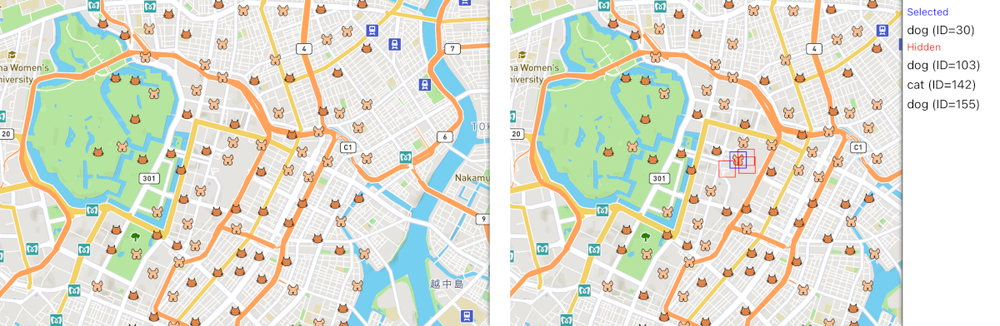

[English](./README.md) / 日本語

# Mapbox Collision Boxesのサンプル

`mapbox-collision-boxes`のデモをする簡単な[Vue 3](https://vuejs.org)アプリです。
このプロジェクトは`npm init vue@latest`で生成しました。

このアプリは東京駅周辺の[Mapbox](https://www.mapbox.com)マップを表示し、ランダムに猫と犬のシンボルを撒き散らします。
猫か犬のシンボルをクリックしどのシンボルが隠されているかを見ることができます。


## はじめる

### 事前準備

[Node.js](https://nodejs.org/en/)をインストールする必要があります。
このライブラリはバージョン16で開発しましたが、バージョン12以降なら問題ないはずです。

[Mapbox GL JS](https://docs.mapbox.com/mapbox-gl-js/guides/)はマップデータをダウンロードするために[アクセストークン](https://docs.mapbox.com/help/getting-started/access-tokens/)を要求します。
アクセストークンはこのレポジトリに含まれていませんので、自身で作成しなければなりません。
[「Mapboxアクセストークンを設定する」](#Mapboxアクセストークンを設定する)もご確認ください。

### Mapboxアクセストークンを設定する

`mapbox-config.ts`ファイルを`src`フォルダに作成し、以下の内容を書き込んでください。
```ts
export const MAPBOX_ACCESS_TOKEN = '<Your Mapbox Access Token Here>';
```

`<Your Mapbox Access Token Here>`をあなたのMapboxアクセストークンで置き換えてください。
`src/mapbox-config.ts`はこのレポジトリにプッシュされません。

### 依存関係を解決する

```sh
pnpm install --frozen-lockfile
```

### 開発サーバーでサンプルを動かす

```sh
pnpm dev
```

開発サーバーは http://localhost:5173 でホストされます。